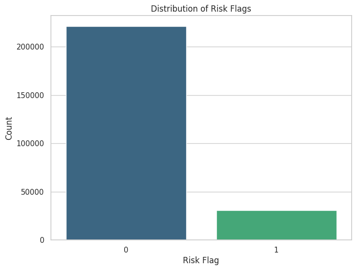
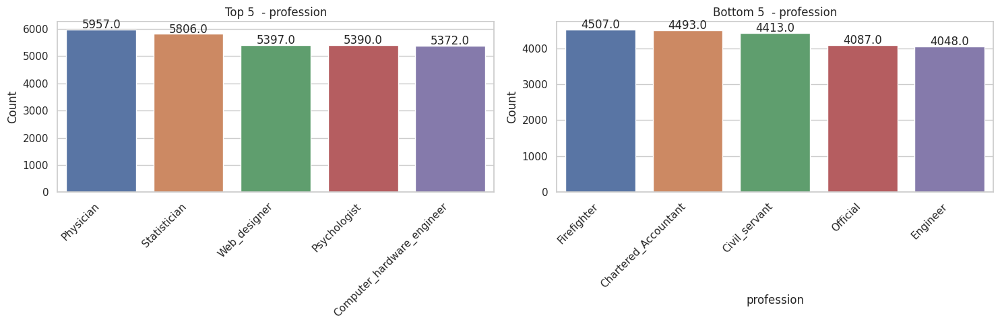
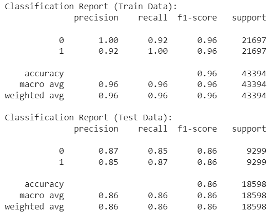

# Customer Loan Default Prediction

## Table of Contents
- [Introduction](#introduction)
- [Objective](#objective)
- [EDA](#EDA)
- [Model](#model)
- [Results](#results)
- [Model Deployment](#Model Deployment)

## Introduction
This repository contains a predictive modeling project aimed at predicting customer loan defaults for a bank. The goal is to develop a predictive model that can assess the likelihood of a customer failing to make loan payments based on historical customer behavior data.

## Objective
The main objectives of this project are:
1. Build a predictive model for customer loan risk prediction.
2. Gain insights into customer behavior based on the provided dataset.

## EDA

## Model
In this project, we aimed to develop a predictive model to identify customers who are at risk of loan default. We utilized three different models for our analysis: Logistic Regression, Decision Tree, and Random Forest Classifier. Let's take a closer look at the performance of each model:

###Logistic Regression
Accuracy: 53%
Although Logistic Regression provides some insights, its accuracy is relatively low compared to other models.
###Decision Tree
Accuracy: 85%
Decision Tree demonstrated a significant improvement in accuracy compared to Logistic Regression. It's important to note that this model may be prone to overfitting, as the accuracy on the training set is notably higher than on the test set.
###Random Forest Classifier
Accuracy: 84%
Random Forest Classifier also showed promising results, with accuracy similar to Decision Tree.
Among the models tested, the Decision Tree model outperformed the others with an accuracy of 85%. However, it's worth noting that this model exhibited signs of overfitting, as indicated by the difference in accuracy between the training and test sets.

To enhance the performance of the Decision Tree model, we conducted hyperparameter tuning using Grid Search. The best parameters obtained from the grid search were:

'criterion': 'gini'
'max_depth': None
'min_samples_leaf': 1
'min_samples_split': 2
'splitter': 'random'
After fine-tuning the model, we achieved an accuracy of 86% on the test set. This indicates that the model's predictive capabilities have improved.

## Results
The Decision Tree model achieved an accuracy of approximately 86% in predicting loan defaults. The insights gained from the model can help the bank identify high-risk customers and make informed decisions to manage credit risk.

## Model Deployment

